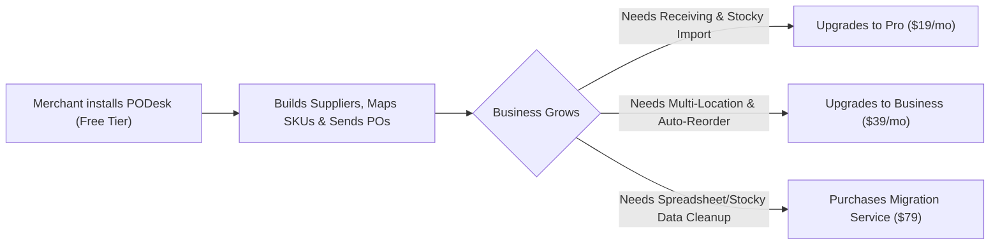

# PODesk: Billing & Pricing Strategy (Freemium Model)

This document outlines the **Freemium Pricing Strategy** for **PODesk: Purchase Orders**. It details the subscription tiers, feature breakdown, monetization strategy, and upgrade triggers designed to maximize merchant adoption on the Shopify App Store.

---

## 🎯 Pricing Philosophy & Goals

1. **Maximum Initial Adoption (Freemium Focus)**:
   - Provide a **generous, fully functional Free Forever tier** to lower the barrier to entry for small-to-medium Shopify merchants.
   - Encourage early reviews, ratings, and word-of-mouth growth on the Shopify App Store.

2. **Affordable Scaling Tiers**:
   - Keep paid plans affordable ($19/mo and $39/mo) so growing stores can upgrade without friction.
   - Competitors (Stocky, Katana, Inventory Planner) charge $50 - $250+/mo. PODesk position as the **most cost-effective, high-value alternative**.

3. **Value-Driven Upgrade Triggers**:
   - Free tier includes full core workflows (Suppliers, SKU Mappings, PO Generation, Reorder Velocity, Emailing).
   - Upgrades are triggered by advanced operational needs: **Partial Receiving**, **Bulk Stocky Import**, **Multi-Location Allocation**, and **White-Glove Migration Services**.

---

## 💳 Subscription Tiers Breakdown

| Plan Tier | Price | Target Merchant | Key Value Proposition |
| :--- | :--- | :--- | :--- |
| **Free / Starter** | **$0 / month** (Free Forever) | Single-location growing stores, small catalog merchants | Full PO creation, supplier records, SKU mapping & basic stockout planning. |
| **Pro** *(Recommended)* | **$19 / month** (14-Day Trial) | Scaling merchants with frequent inventory receipts | Partial receiving workflows, customizable reorder velocity (7–90d), Stocky CSV import & custom PO branding. |
| **Business** | **$39 / month** (14-Day Trial) | Multi-location retailers, POS merchants & large catalogs | Multi-location replenishment, auto-reorder suggestion engine, priority 1-on-1 support. |
| **Migration Service** | **$79** (One-Time) | Merchants migrating from Stocky or spreadsheets | White-glove data extraction, CSV cleaning, SKU verification & 1-on-1 team setup. |

---

## 📊 Detailed Feature Matrix

| Feature / Capability | Free / Starter ($0/mo) | Pro ($19/mo) | Business ($39/mo) |
| :--- | :---: | :---: | :---: |
| **Shopify Product & Variant Sync** | ✅ Unlimited | ✅ Unlimited | ✅ Unlimited |
| **Supplier Records & Contact Management** | ✅ Unlimited | ✅ Unlimited | ✅ Unlimited |
| **Purchase Order Creation & PDF Generation** | ✅ Unlimited | ✅ Unlimited | ✅ Unlimited |
| **SKU-to-Supplier Cost & Lead Time Mapping** | ✅ Included | ✅ Included | ✅ Included |
| **Reorder Velocity Table & Stockout Alerts** | ✅ Standard (30-day velocity) | ✅ Configurable (7–90 days) | ✅ Configurable (7–90 days) |
| **Interactive PO Sharing & Supplier Emailing** | ✅ Included | ✅ Included | ✅ Included |
| **CSV Sample Downloads & Basic Import** | ✅ Included | ✅ Included | ✅ Included |
| **PO Receiving Workflow & Partial Receipts** | ❌ | ✅ Included | ✅ Included |
| **Stocky Bulk CSV Supplier Mapping Import** | ❌ | ✅ Included | ✅ Included |
| **Custom PO Reference Prefix & Branding** | ❌ | ✅ Included | ✅ Included |
| **Historical Receiving Logs & Cost Analytics** | ❌ | ✅ Included | ✅ Included |
| **Multi-Location Inventory Tracking** | ❌ | ❌ | ✅ Included |
| **Auto-Reorder Suggestion Generator** | ❌ | ❌ | ✅ Included |
| **Priority Support & Onboarding** | Standard Email | Standard Email | 🚀 Priority 1-on-1 |

---

## 📈 Upgrade Trigger Strategy (How Merchants Upgrade)



### 1. Free to Pro ($19/mo) Triggers:
- **Receiving & Partial Shipments**: When goods arrive at the warehouse in multiple shipments, merchants need partial receiving tracking.
- **Stocky Migration**: Merchants switching from Stocky want to bulk upload their CSV supplier mapping files instead of mapping one by one.
- **Custom Branding**: Professional merchants want custom PO prefixes (e.g. `PO-2026-001`) and company headers.

### 2. Pro to Business ($39/mo) Triggers:
- **Multi-Location Warehouses**: Merchants managing inventory across multiple retail stores or 3PL locations.
- **Auto-Reorder Suggestions**: Heavy catalog stores (1,000+ SKUs) needing automated bulk PO generation.

---

## 🛠️ Implementation Plan for Shopify App Subscription API

When activating billing post-beta, Shopify's GraphQL Subscription API will be integrated in `app.billing.tsx`:

```ts
// Example Shopify App Subscription GraphQL mutation
const RECURRING_SUBSCRIPTION_MUTATION = `
  mutation AppSubscriptionCreate($name: String!, $lineItems: [AppSubscriptionLineItemInput!]!, $returnUrl: URL!, $test: Boolean) {
    appSubscriptionCreate(name: $name, lineItems: $lineItems, returnUrl: $returnUrl, test: $test) {
      userErrors { field message }
      confirmationUrl
      appSubscription { id status }
    }
  }
`;
```

---

*Document created for PODesk Purchase Orders app.*
